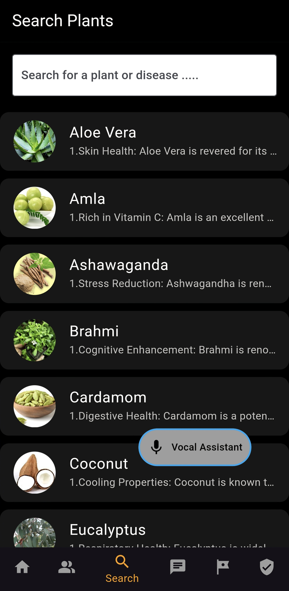
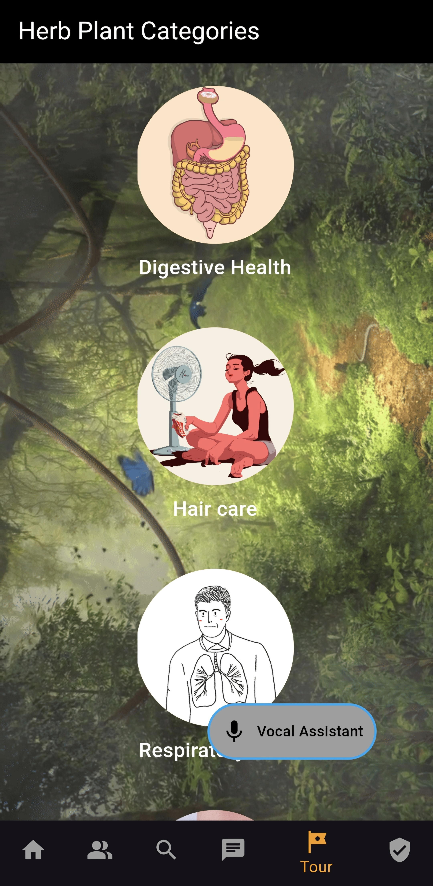
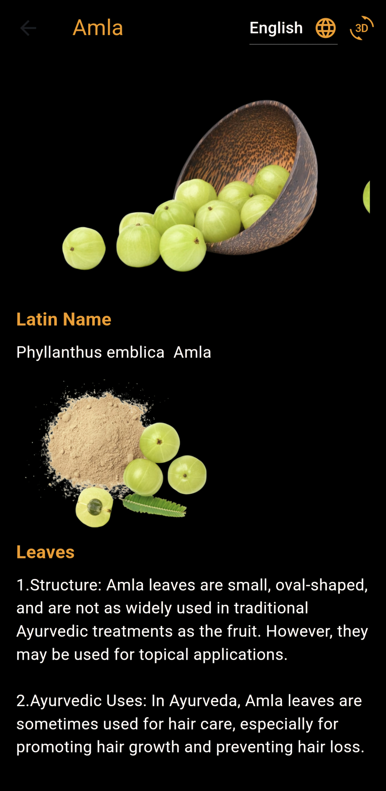
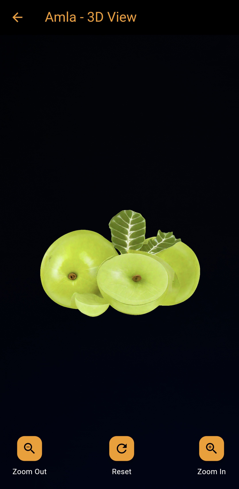

# 🌿 The Prakriti - Virtual Herbal Garden 🌿

**Bringing the world of medicinal plants to your fingertips!**  
The Prakriti is a digital platform designed to bridge the gap between physical herbal gardens and the modern need for accessible, educational resources. This Virtual Herbal Garden provides a rich, interactive, and immersive experience for users to explore the world of medicinal plants from anywhere.

## 🌟 Features

### **1. Interactive 3D Models**
- **Realistic 3D Views**: Rotate, zoom, and examine plants from multiple angles.
- **Immersive Interaction**: Experience plants as if they're right in front of you.

### **2. Comprehensive Plant Profiles**
- **Detailed Information**: Learn about botanical names, common names, habitat, medicinal uses, and cultivation methods.
- **Educational and Informative**: Tailored for herbal enthusiasts and learners alike.

### **3. Multimedia Integration**
- **High-Quality Media**: View stunning images and watch engaging videos.
- **Audio Descriptions**: Listen to detailed information about each plant's significance.

### **4. Search and Filter Options**
- **Advanced Search**: Quickly find plants using names, uses, or other criteria.
- **Filter by Categories**: Explore plants by medicinal uses, regions, or types.

### **5. Virtual Tours**
- **Guided Experiences**: Themed tours focusing on topics like immunity, skincare, and digestive health.

### **6. Community Chat**
- **Engage with Fellow Enthusiasts**: Connect with other users, herbalists, and learners through the community chat feature.
- **Share Knowledge and Insights**: Ask questions, share experiences, and discuss medicinal plants in real-time.

---
## 📸 Screenshots

### **Explore Home Page with interactive UI**

  
  
  

### **Explore Category Page**

  
  
  

